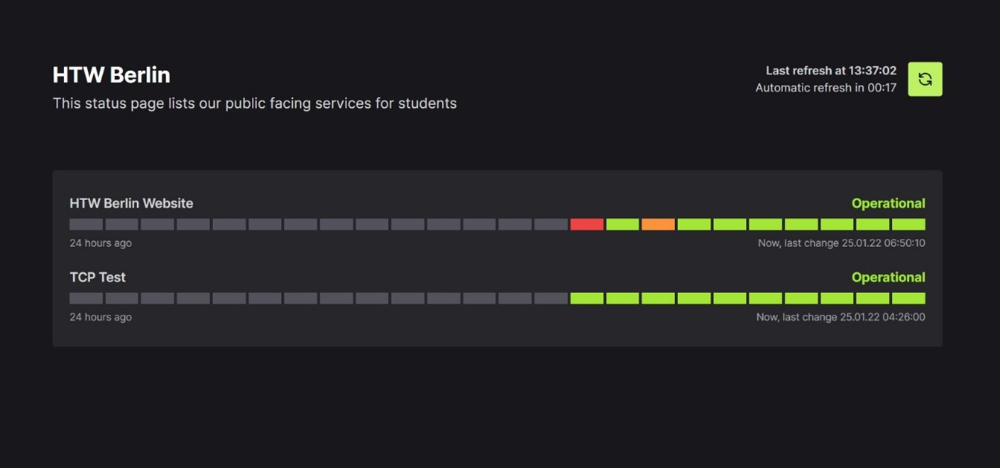
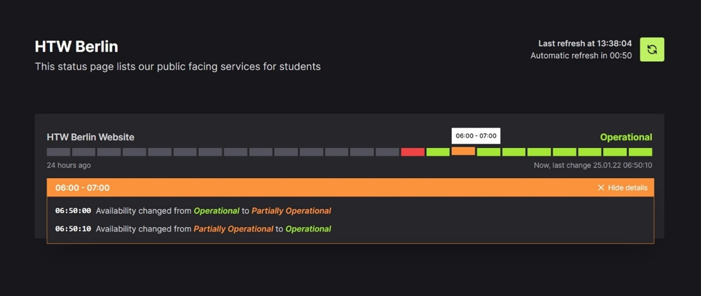

# YASP: Yet Another Status Page
YASP is a minimal distributed fault-tolerant availability monitoring and status page software that I built for my Bachelors degree.




## What can YASP do?
YASP can monitor:
- Via HTTP (GET and HEAD), check for the returned status code and optionally a keyword to be expected inside the returned HTML
- TCP endpoints

YASP itself supports:
- a single node setup
- a cluster setup with at least 3 nodes where a minority of nodes may fail and the cluster stays functional
- checks of the configured monitors from multiple nodes to avoid false positives
- the ability to modify the config file from any node and replicate it to other nodes in case of cluster failure
- displaying monitoring results in minimal status pages
- email notifications via an external SMTP server

## How do I use YASP?

### Running it manually
#### 1. Head to the releases section and download the newest version. Unpack it in a directory.

#### 2. Modify the default node.yml config file
The `./data/node.yml`  file provides the node with important information such as which cluster to connect to, which API key to use and whether to enforce HTTPs and whether to trust proxy servers aswell as logging related information.

**Important**
Make sure the `listen_on` URL is correct! This is required even for single node deployment scenarios.

#### 3. Modify the default app.yml config file
The `./data/app.yml` file stores all information about which monitors to run, their associated settings, the SMTP server to use, which emails to notify in case of status changes and the settings for the status page that should be served.

The provided default app.yml has comments explaining each setting.

#### 4. Run the YASP.Server.exe
By default, the webserver will listen on port `http://*:5000`. To make it listen on different ports, add the startup paramter `--urls "http://*:port`. Make sure to set the correct `listen_on` setting inside the node.yml!

#### 5. (Optional) Run the YASP.Server.exe on more servers to add nodes to your cluster
If running a cluster with more than one node, fault-tolerance requires atleast 3 nodes in the cluster.
To add more nodes to your in step 4. created single node cluster, repeat the steps 1, 2 and 4.

However, when configuring the node.yml in step 2, make sure to enter your first nodes `listen_on` inside the `discovery_endpoints` of all other nodes and make sure you are using the same `api_key` on all nodes. This is required for internode communication.

Other nodes do not require a copy of the app.yml. This file will be synced automatically.

The configured status pages will be reachable on every node.

In case of a node failure (there may only fail a minority of nodes before the cluster stops working), the monitors will be reassigned to working nodes until there is more capacity again.

### Run with Docker or Docker Compose

When running via Docker, the containers `/app/data/` directory need to be persisted to the host machine. Configuration via the respective config files of step 2 and 3 above are done the same way.

The webserver will listen on port 5000 by default. To change it, set the environment variable `ASPNETCORE_URLS` to (for example) `http://*:80`.

#### Docker Compose

```yml
version: "3"
services:
  yasp:
    image: 'ghcr.io/ryantt/yasp-monitoring:latest'
    restart: unless-stopped

    ports:
      - "8080:5000"

    volumes:
      - ./node1/data:/app/data
```

#### Docker

```
docker run -d --restart=unless-stopped -p 8080:5000 -v "1/data:/app/data" --name yasp ghcr.io/ryantt/yasp-monitoring:latest
```